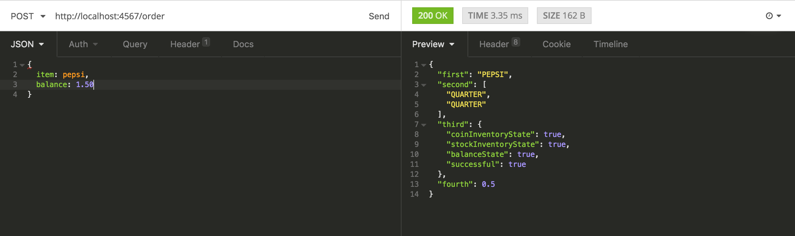

## Description

This is a simple RESTful API with a multiple set of routes to operate a vending machine.
It's main function is to return a JSON object upon an order 'request' (item, balance) with a response
'bucket' (item, change, transaction-state, receipt).

It also allows to manipulate inventory data (coins, items) through other routes. It can be used
to integrate with client-side by making requests and render based on the response.

The stack used for the project is the following:

- Spark (RESTful routing).
- Hibernate (Object-relational-mapping).
- JAVA
- MySQL (connects)

A client-side has been developed to simulate visually the operation of this API, click .

## How to run

- Clone this repo into your local machine.
```
git clone https://github.com/HuascarMC/vending-machine-server
```
- Go inside your vending-machine-server directory.
```
cd vending-machine-server
```
- Install all the dependencies required and compile.
```
./gradlew build
```
- Run
```
./gradlew run
```

f.e:
```
POST /order
with JSON body:
JSON => {item: pepsi, balance: 1.50}
http://localhost:4567/items
```



## Functionality

- *UNDER CONSTRUCTION*


# Things to improve/currently working on.

- More test cases.

- Routes have not been tested.

- DBHelper hasn't been tested.

- Issues with CORS when making requests with the same origin.

- Double coin, item objects unnecessary (DB, machine object).

- **A LOT MORE** 
