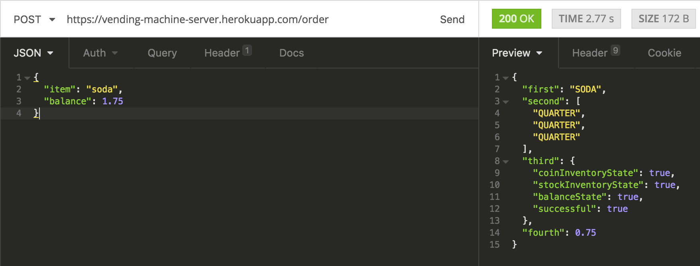
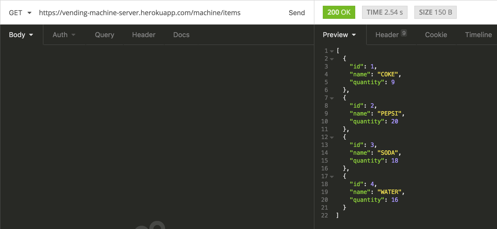
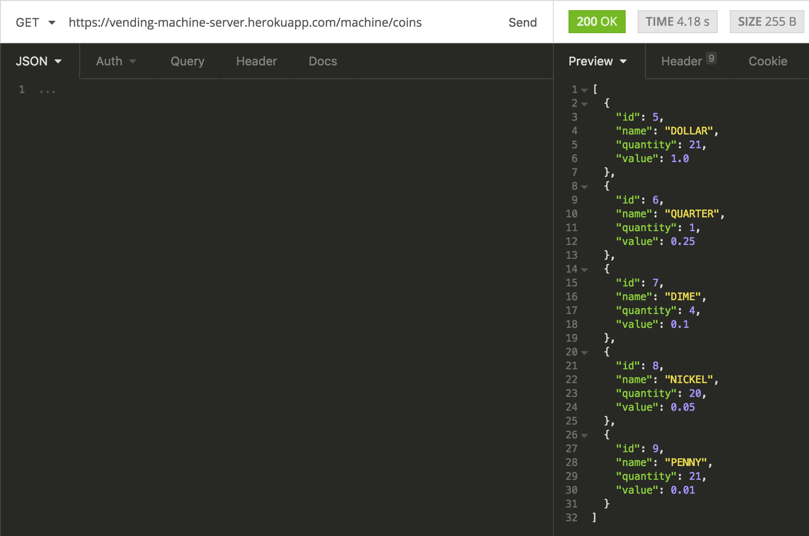

# Running on the cloud with Heroku and DB with AWS

## Click [here](https://vending-machine-server.herokuapp.com).

## Description

RESTful API with a multiple set of routes to operate a vending machine.
It's main function is to return a JSON object as response when an order 'request' (item, balance) is made.
The response object is a 'bucket' that contains transaction information (item, change, transaction-state, receipt).

It also allows to manipulate inventory data (coins, items) through other routes. The service has been built to integrate with a [client-side](https://github.com/HuascarMC/vending-machine-client) that simulates the operation visually.

The stack used for the project is the following:

- Spark (RESTful routing)
- Hibernate (ORM)
- JAVA
- Cloud MySQL (AWS cloud RDS)
- Gradle

**NOTE**
*not stable*
 The project is currently running on the cloud with an UI, it may take a while to load as Heroku puts the dynos to sleep when inactive. One is able to launch both the server and the client by just clicking [here](https://vending-machine-server.herokuapp.com) and following the instructions. If it doesn't load quickly, leave it for a while and then refresh. Try not to make too many requests at once as it can crash the server and it will need to be re-deployed.

**NOTE**
The API is public and it can be used by anyone. There are some bugs and the deployed version sometimes crashes. The following images show requests/response examples using Insomnia:

Order object:





Items inventory:





Coin inventory:




## How to run

**NOTE**:
In case you would like to run it locally you would have to clone this repo's branch 'local'. This branch just changes the remote database that runs with AWS to a local one called 'test'.

- Open terminal and run mysql:
```
mysql -u root
```
- Create a database called 'test':
```
CREATE DATABASE test;
```
- Access the database:
```
USE test;
```
- Clone the 'local' branch of this repo:
```
git clone https://github.com/HuascarMC/vending-machine-server/tree/local
```
- Go inside the new vending-machine-server directory.
```
cd vending-machine-server
```
- Install all the dependencies required and compile.
```
./gradlew build
```
- Run
```
./gradlew run
```

Now you should be able to check if the server is running by clicking [here](http://localhost:4567/) or start making get requests using 'Insomnia' or 'Postman' as shown in the images above but replacing it with:
```
http://localhost:4567/
```

## Functionality

*TO BE EXPANDED*

- Get inventory, pass 'coins' or 'items' as params(:inventory):
```
GET /machine/:inventory
```
- Make an order:
```
POST /order | JSON {"item": "soda", "balance": 1.75}
```

# Things to improve/currently working on.

- Deployed version crashes.

- Block routes.

- DBHelper unsafe.

- More test cases.

- Routes have not been tested.

- Crashes when making many requests.

- Queries to AWS slow.

- DBHelper hasn't been tested.

- Issues with CORS when making requests with the same origin.

- Fails to load class "org.slf4j.impl.StaticLoggerBinder".

- Hibernate properties not found.

- Many warnings

- Double coin, item objects unnecessary (DB, machine object).

- **MORE**
